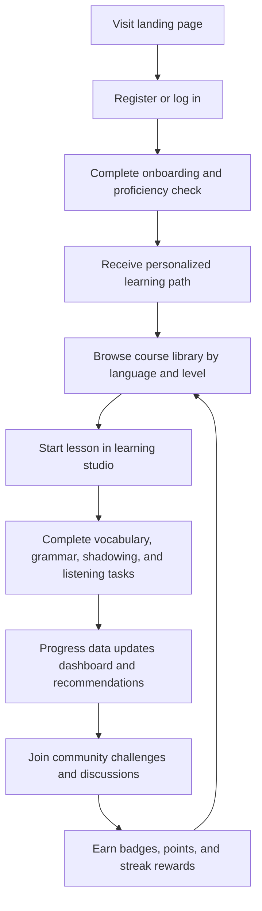

## 1. Product Overview
An immersive online language learning platform that supports English, Japanese, Korean, and additional mainstream languages through structured courses, interactive practice, and social motivation.
- Serves self-directed learners who need a guided path from beginner to advanced proficiency across reading, listening, speaking, grammar, and vocabulary.
- Creates market value by combining formal curriculum progression with adaptive recommendations, measurable progress, and community-driven retention loops.

## 2. Core Features

### 2.1 User Roles
| Role | Registration Method | Core Permissions |
|------|---------------------|------------------|
| Learner | Email, password, social sign-in | Enroll in courses, complete lessons, track progress, join community, earn achievements |
| Instructor/Moderator | Admin invitation | Manage course content, review community reports, highlight learning challenges |
| Admin | Secure admin account | Manage users, languages, content levels, incentives, and platform settings |

### 2.2 Feature Module
1. **Landing page**: product introduction, language catalog, leveled learning pathways, social proof, call-to-action
2. **Authentication pages**: registration, login, password reset, profile onboarding, preferred language selection
3. **Course library page**: language selection, CEFR or custom level browsing, course filters, recommendation entry points
4. **Learning studio page**: vocabulary memorization, grammar exercises, oral shadowing, listening training, lesson navigation
5. **Progress dashboard page**: streaks, completion rates, proficiency milestones, skill radar, weekly goals
6. **Community page**: discussion feed, study circles, challenge boards, leaderboard, achievement showcase
7. **Profile and settings page**: learning goals, interests, notification settings, achievement history, preferred UI language
8. **Admin console page**: course management, moderation queue, recommendation rules, platform analytics

### 2.3 Page Details
| Page Name | Module Name | Feature description |
|-----------|-------------|---------------------|
| Landing page | Hero experience | Presents immersive value proposition, supported languages, and quick path to start learning |
| Landing page | Level overview | Explains beginner, intermediate, advanced learning stages with sample outcomes |
| Authentication pages | Registration and onboarding | Captures account details, target language, current proficiency, goals, and learning preferences |
| Course library page | Language and level explorer | Lets users browse by target language, difficulty level, skill focus, and estimated study time |
| Course library page | Personalized recommendations | Surfaces suggested next lessons and study plans based on user goals and recent activity |
| Learning studio page | Vocabulary memorization | Uses spaced review cards, example sentences, pronunciation playback, and quick recall checks |
| Learning studio page | Grammar exercises | Offers pattern explanation, fill-in-the-blank tasks, sentence transformation, and instant feedback |
| Learning studio page | Oral shadowing | Plays native audio, records user responses, compares rhythm and pacing, and stores practice attempts |
| Learning studio page | Listening training | Includes dialogue playback, comprehension questions, dictation, and speed control |
| Progress dashboard page | Skill progress tracking | Displays lesson completion, accuracy, streaks, time spent, and level advancement by skill |
| Progress dashboard page | Goal management | Allows learners to set daily or weekly targets and see completion status |
| Community page | Discussion and peer support | Enables posts, comments, study groups, challenge participation, and helpful-answer recognition |
| Community page | Achievement incentives | Grants badges, points, streak awards, challenge trophies, and leaderboard visibility |
| Profile and settings page | Personal learning path | Lets users refine goals, choose study intensity, and update preferred interface language |
| Admin console page | Content and moderation | Supports course publishing, language catalog control, report handling, and incentive configuration |

## 3. Core Process
New learners create an account, choose their interface language and target language, complete a short onboarding assessment, and receive a recommended starting level and study path. They then move through structured lessons in the learning studio, complete interactive exercises, and see measurable progress in the dashboard. Community challenges, badges, and peer interaction reinforce retention and motivate consistent study.

## 4. User Interface Design
### 4.1 Design Style
- Primary colors: deep midnight navy, electric cyan, warm coral, and soft jade accents for skill differentiation
- Button style: rounded, layered depth with subtle glow states and strong focus outlines
- Font and sizes: expressive display serif for headings paired with a highly legible sans-serif for body content; generous desktop sizing for immersive course presentation
- Layout style: desktop-first split-panel interface with editorial hero sections, modular dashboards, and card-driven learning components
- Icon and illustration style suggestions: refined line icons, language-themed abstract motifs, pronunciation waveforms, and achievement medallions

### 4.2 Page Design Overview
| Page Name | Module Name | UI Elements |
|-----------|-------------|-------------|
| Landing page | Hero experience | immersive headline, layered gradient background, language chips, animated course previews |
| Course library page | Language and level explorer | filter rail, rich course cards, progress tags, recommendation banners |
| Learning studio page | Practice workspace | sticky lesson navigator, exercise panel, audio controls, recording states, feedback cards |
| Progress dashboard page | Analytics modules | streak meter, skill charts, milestone timeline, weekly target cards |
| Community page | Social engagement | discussion feed, challenge banners, leaderboard cards, achievement gallery |
| Profile and settings page | Personalization | preference form, language toggles, badges list, study path summary |
| Admin console page | Operational modules | data tables, moderation panels, publishing forms, analytics snapshots |

### 4.3 Responsiveness
Desktop-first design with mobile-adaptive layouts. Core learning interactions prioritize large-screen immersion while maintaining touch-friendly lesson controls, collapsible navigation, responsive charts, and optimized audio controls for tablets and phones.
