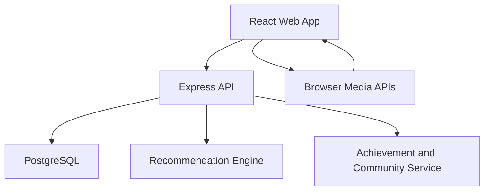
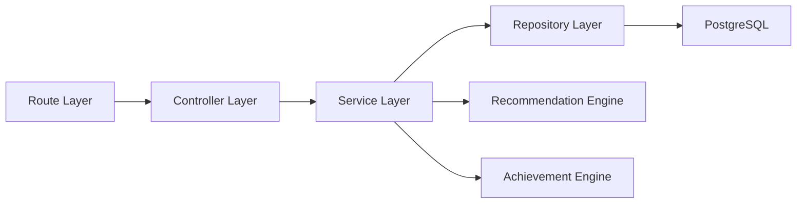
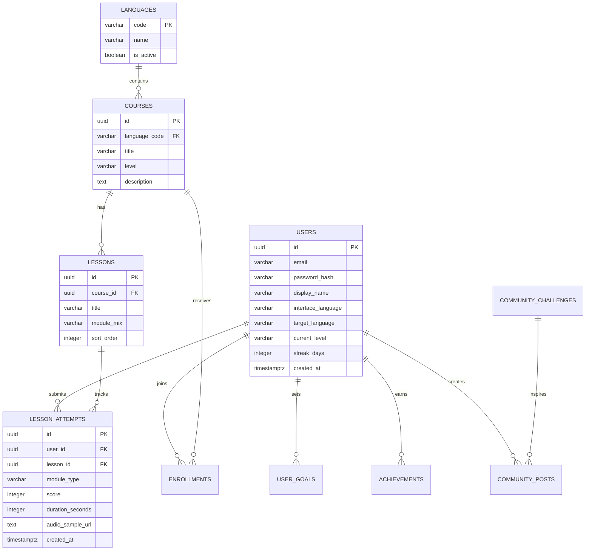

## 1. Architecture Design


## 2. Technology Description
- Frontend: React@18 + TypeScript + tailwindcss@3 + vite
- Initialization Tool: vite
- Backend: Node.js + Express@4 + TypeScript
- Database: PostgreSQL@16
- Authentication: JWT access token + refresh token with secure HTTP-only cookies
- Audio Features: Browser MediaRecorder API, Web Audio API, HTML5 audio playback
- Recommendation Strategy: server-side rule-based recommendation engine using learner goals, proficiency level, completion history, and weak-skill signals
- Internationalization: `react-i18next` for frontend locale switching and database-backed multilingual content fields

## 3. Route Definitions
| Route | Purpose |
|-------|---------|
| / | Landing page with product story, language catalog, and enrollment entry |
| /auth/register | User registration and onboarding start |
| /auth/login | User login |
| /onboarding | Proficiency assessment, goal selection, and target language setup |
| /courses | Course library with language and level filters |
| /courses/:courseId | Course overview and lesson list |
| /learn/:lessonId | Interactive learning studio for practice modules |
| /dashboard | Progress tracking, streaks, and recommendations |
| /community | Community feed, challenges, and leaderboard |
| /profile | User profile, achievements, and learning preferences |
| /admin | Admin console for content, moderation, and analytics |

## 4. API Definitions
### Core Type Definitions
```ts
type SupportedLanguage =
  | "en"
  | "ja"
  | "ko"
  | "zh"
  | "es"
  | "fr"
  | "de";

type ProficiencyLevel =
  | "beginner"
  | "elementary"
  | "intermediate"
  | "upper_intermediate"
  | "advanced";

interface UserProfile {
  id: string;
  email: string;
  displayName: string;
  interfaceLanguage: SupportedLanguage;
  targetLanguage: SupportedLanguage;
  currentLevel: ProficiencyLevel;
  weeklyGoalMinutes: number;
  streakDays: number;
}

interface LessonRecommendation {
  lessonId: string;
  reason: string;
  targetSkill: "vocabulary" | "grammar" | "shadowing" | "listening";
  estimatedMinutes: number;
}
```

### API Endpoints
| Method | Endpoint | Purpose |
|--------|----------|---------|
| POST | /api/auth/register | Create learner account and profile |
| POST | /api/auth/login | Authenticate user and issue tokens |
| POST | /api/auth/logout | Revoke refresh token and end session |
| GET | /api/languages | Return supported UI and study languages |
| GET | /api/courses | List courses filtered by language, level, and skill |
| GET | /api/courses/:courseId | Return course details and lesson metadata |
| GET | /api/lessons/:lessonId | Return lesson content and exercise blocks |
| POST | /api/lessons/:lessonId/attempts | Submit exercise results and audio metadata |
| GET | /api/progress/me | Return learner progress summary and skill analytics |
| GET | /api/recommendations/me | Return personalized next-step recommendations |
| GET | /api/community/feed | Return discussion posts and active challenges |
| POST | /api/community/posts | Create a post or challenge response |
| POST | /api/achievements/evaluate | Evaluate rewards after study events |
| GET | /api/admin/overview | Return moderation, content, and usage metrics |

### Request and Response Schemas
```ts
interface RegisterRequest {
  email: string;
  password: string;
  displayName: string;
  interfaceLanguage: SupportedLanguage;
  targetLanguage: SupportedLanguage;
}

interface LessonAttemptRequest {
  lessonId: string;
  moduleType: "vocabulary" | "grammar" | "shadowing" | "listening";
  score: number;
  durationSeconds: number;
  audioSampleUrl?: string;
  answers: Array<{
    itemId: string;
    isCorrect: boolean;
    responseText?: string;
  }>;
}

interface ProgressSummaryResponse {
  totalStudyMinutes: number;
  completedLessons: number;
  currentLevel: ProficiencyLevel;
  skillAccuracy: Record<"vocabulary" | "grammar" | "shadowing" | "listening", number>;
  weeklyGoalProgress: number;
  unlockedAchievements: string[];
  nextRecommendations: LessonRecommendation[];
}
```

## 5. Server Architecture Diagram


## 6. Data Model
### 6.1 Data Model Definition


### 6.2 Data Definition Language
```sql
CREATE TABLE users (
  id UUID PRIMARY KEY,
  email VARCHAR(255) UNIQUE NOT NULL,
  password_hash VARCHAR(255) NOT NULL,
  display_name VARCHAR(120) NOT NULL,
  interface_language VARCHAR(10) NOT NULL,
  target_language VARCHAR(10) NOT NULL,
  current_level VARCHAR(32) NOT NULL DEFAULT 'beginner',
  streak_days INTEGER NOT NULL DEFAULT 0,
  weekly_goal_minutes INTEGER NOT NULL DEFAULT 150,
  created_at TIMESTAMPTZ NOT NULL DEFAULT NOW()
);

CREATE TABLE languages (
  code VARCHAR(10) PRIMARY KEY,
  name VARCHAR(80) NOT NULL,
  is_active BOOLEAN NOT NULL DEFAULT TRUE
);

CREATE TABLE courses (
  id UUID PRIMARY KEY,
  language_code VARCHAR(10) NOT NULL REFERENCES languages(code),
  title VARCHAR(200) NOT NULL,
  level VARCHAR(32) NOT NULL,
  description TEXT NOT NULL
);

CREATE TABLE lessons (
  id UUID PRIMARY KEY,
  course_id UUID NOT NULL REFERENCES courses(id) ON DELETE CASCADE,
  title VARCHAR(200) NOT NULL,
  module_mix VARCHAR(120) NOT NULL,
  sort_order INTEGER NOT NULL
);

CREATE TABLE lesson_attempts (
  id UUID PRIMARY KEY,
  user_id UUID NOT NULL REFERENCES users(id) ON DELETE CASCADE,
  lesson_id UUID NOT NULL REFERENCES lessons(id) ON DELETE CASCADE,
  module_type VARCHAR(32) NOT NULL,
  score INTEGER NOT NULL,
  duration_seconds INTEGER NOT NULL,
  audio_sample_url TEXT,
  created_at TIMESTAMPTZ NOT NULL DEFAULT NOW()
);

CREATE INDEX idx_courses_language_level ON courses(language_code, level);
CREATE INDEX idx_lesson_attempts_user_created_at ON lesson_attempts(user_id, created_at DESC);

INSERT INTO languages (code, name) VALUES
  ('en', 'English'),
  ('ja', 'Japanese'),
  ('ko', 'Korean'),
  ('zh', 'Chinese'),
  ('es', 'Spanish'),
  ('fr', 'French'),
  ('de', 'German');
```
